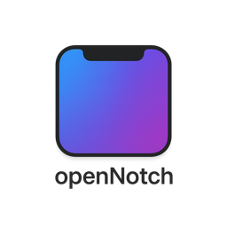

<p align="center">
  
</p>

<h1 align="center">OpenNotch</h1>

<p align="center">
  <a href="README.md">English</a> | 简体中文
</p>

<p align="center">
  <strong>把 MacBook 刘海变成鲜活的原生交互区域。</strong>
</p>

<p align="center">
  OpenNotch 是一款面向带刘海 MacBook 的原生 macOS 应用。它会把刘海区域变成实时系统界面，
  用于展示媒体播放、下载、AirDrop、计时器、录屏、网络连接事件、锁屏过渡、自定义硬件 HUD，
  以及完全可配置的交互式 Dashboard。
</p>

<p align="center">
  
  
  
  <a href="LICENSE">
    
  </a>
</p>

<p>
  
</p>

## 为什么选择 OpenNotch

OpenNotch 把 MacBook 刘海视为一个紧凑的原生界面，而不是静态的屏幕开孔。
平时它会贴合硬件形状保持低调；当重要事件发生时，则通过队列驱动的展示逻辑、手势支持和系统感知的功能路由进行展开。

应用使用 SwiftUI 和 AppKit 构建，因此刘海窗口、设置界面和事件处理都更接近 macOS 原生体验，而不是网页式浮层。

刘海引擎从零实现，完整复刻了 iPhone 灵动岛的逻辑、动画和行为，而不是直接借用现有库。

OpenNotch 的灵感来源和参考了以下开源项目：

- **[DynamicNotch](https://github.com/MrKai77/DynamicNotch)** by MrKai77 - 基础刘海浮层架构和窗口管理方案。
- **[BoringNotch](https://github.com/TheBoredTeam/boring.notch)** by TheBoredTeam - 音乐播放器、音频频谱可视化、HUD 拦截和功能集方面的 UI 灵感。

## 亮点

- **实时活动**：支持正在播放、下载、AirDrop、计时器、录屏、专注模式、个人热点和锁屏媒体界面
- **临时提醒**：支持充电、低电量、满电、蓝牙、Wi-Fi、VPN、关闭专注模式和刘海尺寸调整反馈
- **自定义硬件 HUD**：替换 macOS 默认的亮度、键盘亮度和音量浮层
- **交互式 Dashboard**：鼠标悬停在刘海上即可打开扩展面板，包含应用启动器、时间日期、系统状态和番茄钟
- **自适应应用网格**：根据固定应用数量从 1x2 扩展到 3x4，最多支持 12 个应用
- **胶囊小组件栏**：最多显示两个实时指标，支持 CPU、内存、磁盘和网络速度，可用进度环或文字呈现
- **番茄钟内联编辑**：无需打开设置，可直接在 Dashboard 中通过 +/- 控件调整工作时长
- **完整显示器位置控制**：可选择刘海浮层出现在哪一块显示器上
- **原生交互**：支持点击展开、鼠标拖拽手势、触控板滑动、滑动关闭和滑动恢复
- **丰富个性化选项**：可配置刘海宽度、高度、背景样式、描边、动画预设、全屏行为和应用语言
- **锁屏控制**：支持声音、媒体面板行为、小组件外观、色调和背景亮度设置
- **录屏指示器**：当 macOS 报告正在屏幕捕获时，会在刘海区域点亮提示

## Dashboard 与概览

Dashboard 会在鼠标悬停刘海时打开，其中包含：

| 区域 | 说明 |
|---|---|
| 应用启动器 | 快速启动固定应用。支持自适应网格布局，也可隐藏应用名称。 |
| 时间与日期 | 大号时钟与日期显示，可选天气信息。 |
| 系统信息 | 实时显示 CPU、内存和磁盘使用情况。 |
| 番茄钟 | 内联工作会话倒计时，支持通过 +/- 控件调整时长。 |

每个区域都可以在 **Settings -> Interface** 中单独启用或关闭。

## 设置

设置分为四组：

**Application**
- General - 启动项、显示器位置、语言、外观
- Permissions - 辅助功能、蓝牙、媒体控制权限
- Notch - 背景、描边、动画、尺寸调整反馈
- Interface - Dashboard 布局、应用网格、固定应用、概览可见性

**Media & Files**
- Now Playing、Downloads、Drag & Drop

**Connectivity**
- Focus、Bluetooth、Network

**System**
- Timer、Screen Recording、Battery、HUD、Lock Screen

## 安装

1. 克隆或下载源码，并使用 Xcode 构建。
2. 将构建后的 app 拖入 `Applications`。
3. 启动应用，并授予所需权限。
4. 如果 macOS 阻止首次启动，请在 `System Settings -> Privacy & Security` 中允许打开。

## 系统要求

- macOS 14.6 或更高版本
- 带硬件刘海的 MacBook
- 按功能需要授予相关权限：
  - 辅助功能权限：用于自定义 HUD 拦截
  - 蓝牙权限：用于配件状态更新
  - 屏幕录制权限：用于正在播放的音频响应式可视化

## 从源码构建

```bash
git clone https://github.com/Protope-Eiw/OpenNotch.git
cd OpenNotch
open OpenNotch.xcodeproj
```

在 Xcode 中运行 `OpenNotch` scheme。Swift Package Manager 依赖会自动解析。

## 仓库结构

```text
OpenNotch/
├── Application/        # App 入口、AppDelegate、窗口设置和设置页外壳
├── Core/               # 共享模型、协议、服务和基础设施
├── Features/
│   ├── DragAndDrop/
│   ├── Battery/
│   ├── Bluetooth/
│   ├── Download/
│   ├── Focus/
│   ├── HUD/
│   ├── LockScreen/
│   ├── Network/
│   ├── Notch/
│   ├── NowPlaying/
│   ├── Onboarding/
│   ├── ScreenRecording/
│   ├── Settings/
│   └── Timer/
├── Resources/          # 资源、国际化、本地媒体文件
└── Shared/             # 共享 UI、辅助工具和扩展

OpenNotchTests/
OpenNotchUITests/
```

## 架构概览

- `AppContainer` 负责组装服务、监视器、功能 ViewModel、协调器和窗口管理器。
- `AppDelegate` 管理应用生命周期、浮层窗口设置、工作区观察者和锁屏交接。
- `NotchEngine` 拥有队列驱动的刘海展示状态机，用于实时活动、临时提醒、过渡和恢复流程。
- `NotchViewModel` 是面向 SwiftUI 的层，负责几何尺寸、手势、交互式调整和基于引擎的展示状态。
- `NotchEventCoordinator` 负责路由系统事件，具体功能处理器再将事件转换为刘海内容。
- `SettingsViewModel` 作为设置门面，管理应用、媒体/文件、连接、电池、HUD 和锁屏等专用设置存储。
- 各功能 ViewModel 为电池、蓝牙、下载、网络、正在播放、录屏、计时器、AirDrop 和锁屏提供领域状态。

## 技术栈

- SwiftUI：用于刘海内容和设置界面
- AppKit：用于窗口、输入处理和 macOS 集成
- Combine：用于功能状态和设置数据流
- [Lottie](https://github.com/airbnb/lottie-ios)：用于动画资源

## 本地化

- 系统语言回退
- 英语
- 俄语
- 西班牙语
- 简体中文

## 许可证

OpenNotch 基于 GNU General Public License v3.0 发布。详情请参阅 [LICENSE](LICENSE)。
